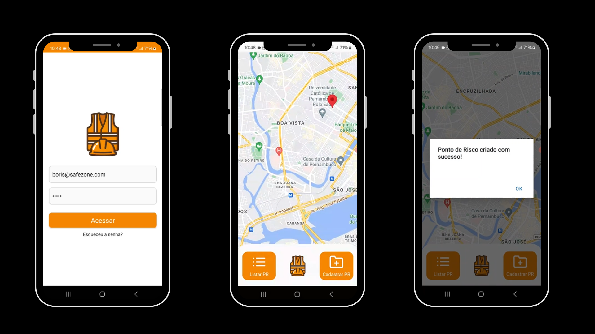

# SafeZone: Gerenciamento de Pontos de Risco 📱


<br>

## Descrição 📋

SafeZone é um aplicativo mobile desenvolvido para auxiliar no gerenciamento de pontos de risco em obras e indústrias.
Feito em React Native, O SafeZone permite registrar, atualizar e visualizar facilmente áreas que requerem atenção especial em um mapa interativo. Além de trabalhar com API que faz criptografia de senhas e autenticação JWT para usuários logados.

<br>
<br>

## Tecnologias Utilizadas 💎

- **React Native:** <br>
- **React Navigation** <br>
- **Expo** <br>
- **Cloudinary** <br>
- **Expo Image Picker** <br>
- **Expo Location** <br>
- **React Native Maps** <br>

<br>
<br>

## Funcionalidades 🔧

1. **Cadastro de pontos de risco**
2. **Captura de imagens por câmera e geolocalização**
3. **Visualização de pontos de risco em mapa interativo**
4. **Atualização de pontos de risco**
5. **Remoção de pontos de risco**

<br>
<br>

## Seguraça e Autenticação 🔒

O SafeZone agora oferece recursos de segurança aprimorados com:

1. **Criptografia de senha Bcrypt:** As senhas dos usuários são armazenadas com segurança usando criptografia Bcrypt, protegendo-as contra acessos não autorizados. <br>
2. **Autenticação JWT:** A autenticação JWT é usada para controlar o acesso aos recursos do aplicativo, garantindo que apenas usuários autorizados possam acessá-los.

<br>

## Pré-requisitos 📦

- React Native <br>
- npm (gerenciador de pacotes) <br>
- Um dispositivo mobile com Android ou iOS. <br>
- Uma conta gratuita na https://expo.dev/ <br>
- Uma conta gratuita no Cloudinary https://cloudinary.com/ <br>

<br>
<br>

## Instalação 🛠️

1. Clone este repositório para a sua máquina local:

```bash
git clone https://github.com/seu-usuario/safezone-frontend.git
```

<br>

2. Acesse o diretório do projeto:

```bash
cd safezone-frontend
```

<br>

3. Instale as dependências do projeto:

```bash
npm install
```

<br>

4. Rodar o comando

```bash
npm expo start
```

<br>

5. Ler o QRCode gerado no console com o app Expo Go.

## Configuração ⚙️

1. Crie um arquivo `.env` na raiz do projeto. <br>
2. Crie as variáveis de ambiente com as chaves do cloudinary e a Cloudinary URL <br>
3. Insira no código as variáveis de ambiente. <br>

<br>
<br>

## Contribuição 🤝

Suas contribuições para este projeto são muitob bem-vindas! Se você encontrar algum bug ou tiver sugestões de melhorias, por favor, envie um issue no GitHub.

<br>
<br>

## Licença 📚

Este projeto está licenciado sob a MIT License.
